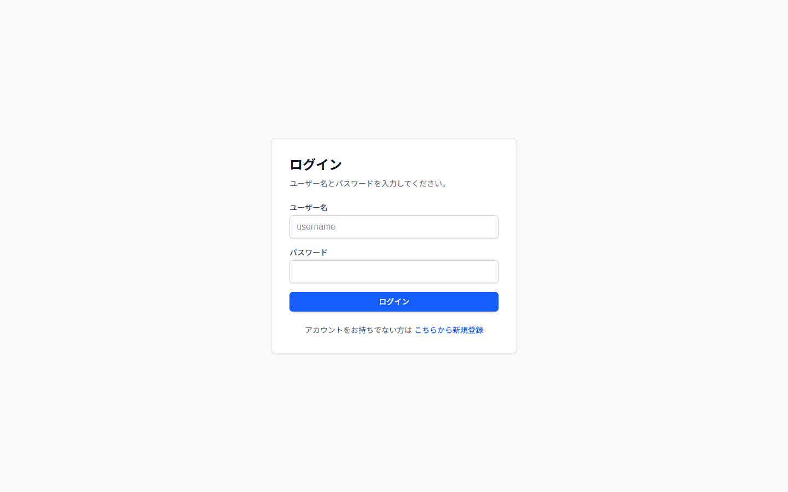
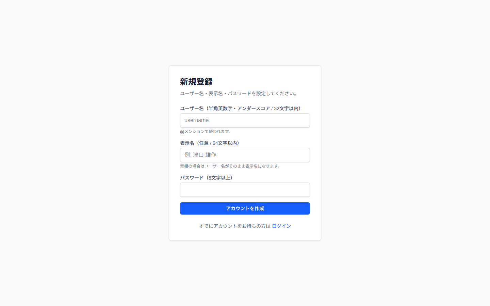
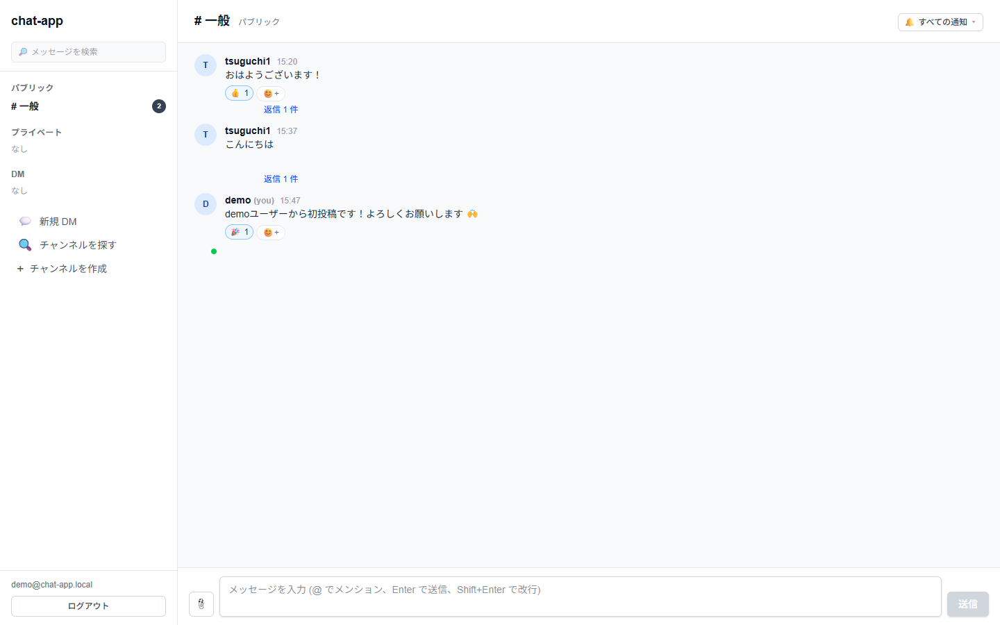
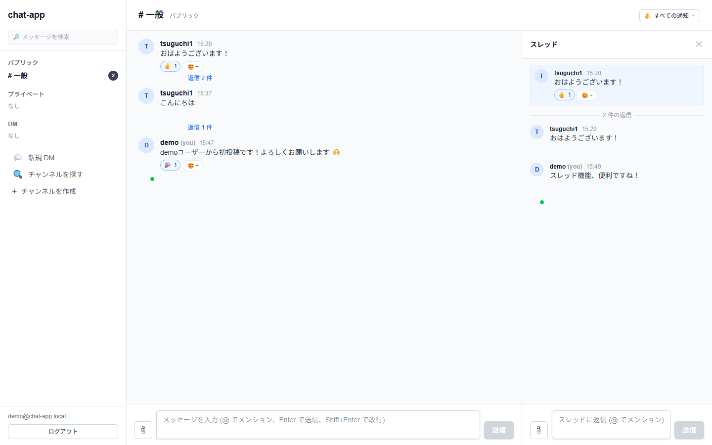
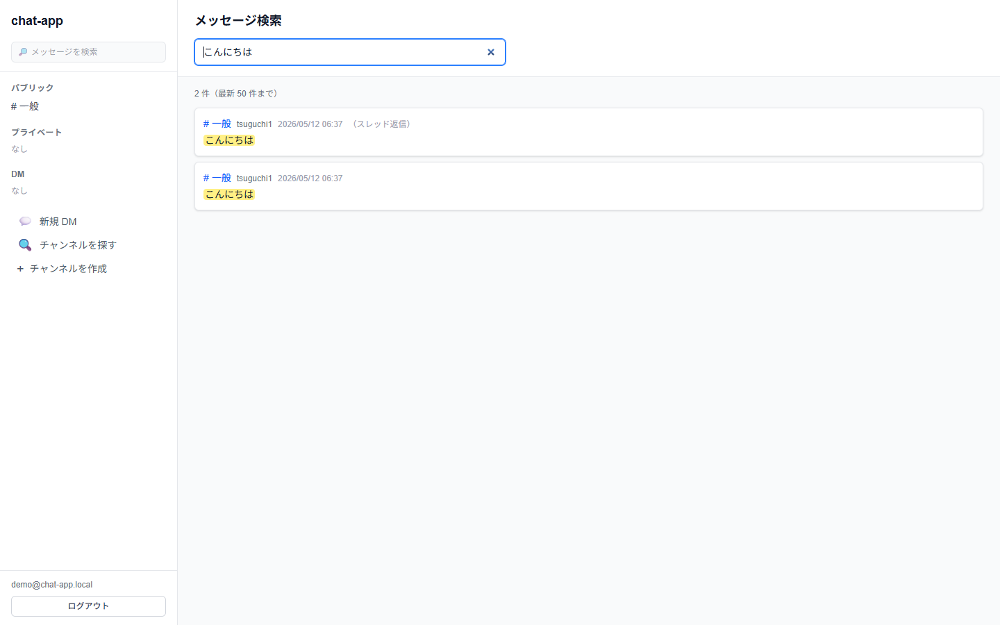
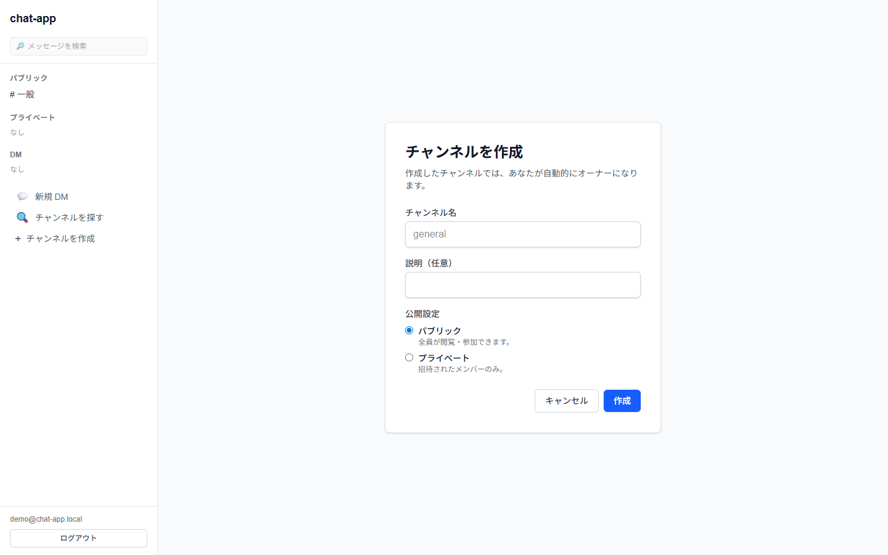
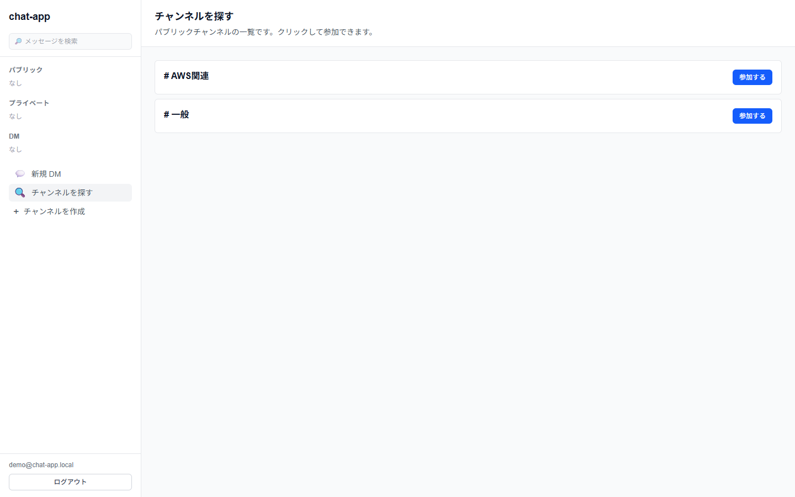

# chat-app

Slackライクな社内向けチャットアプリ。

本番URL: <https://chat-app-theta-seven-80.vercel.app>

## 概要

小規模チーム（〜50人）向けのリアルタイムチャットアプリ。
DM、チャンネル、スレッド、メンション、リアクション、ファイル共有、検索などをサポート。

## スクリーンショット

### ログイン / 新規登録

| ログイン | 新規登録 |
| --- | --- |
|  |  |

ユーザー名 + パスワード方式。誰でも `/signup` からアカウントを作成可能（メール不要）。

### メインのチャット画面



サイドバーにチャンネル / DM、中央にタイムライン。各メッセージにマウスを乗せるとリアクション・返信・編集・削除のアクションが表示される。

### スレッド返信



メッセージから「返信」を押すと右側にスレッドパネルが開き、本チャンネルを汚さずに会話を分岐できる。

### メッセージ検索



PostgreSQL の pg_trgm GIN インデックスでサーバー側検索。本文のヒット箇所はハイライト表示。

### チャンネル作成 / 探す

| チャンネルを作成 | チャンネルを探す |
| --- | --- |
|  |  |

パブリック / プライベートを選んで作成。パブリックは「探す」から誰でも参加可能。

## 機能

- ユーザー名 + パスワード認証（メール不要 / 自由サインアップ）
- パブリック / プライベートチャンネル
- 1対1 DM / グループ DM
- スレッド返信
- メンション（`@user` / `@channel` / `@here`）
- 標準絵文字リアクション
- ファイル添付（複数 / 1ファイル 10MB / 画像インライン表示）
- メッセージ編集・削除
- ソフト削除（メッセージ） / カスケード削除（チャンネル）
- プレゼンス（オンラインドット）
- 未読 / メンションバッジ
- チャンネル単位のミュート設定（all / mentions / none）
- メッセージ検索（pg_trgm）
- ワークスペース管理者による他人メッセージ削除
- プライベートチャンネル招待

## 技術スタック

| レイヤ         | 技術                                               |
| -------------- | -------------------------------------------------- |
| フロントエンド | Next.js 16 (App Router, Turbopack) + TypeScript    |
| UI             | Tailwind CSS v4                                    |
| 認証           | Supabase Auth (Email+Password, 架空メールでラップ) |
| データベース   | Supabase PostgreSQL                                |
| リアルタイム   | Supabase Realtime (postgres_changes + presence)    |
| ストレージ     | Supabase Storage (`attachments` バケット, private) |
| 検索           | pg_trgm + GIN インデックス                         |
| ホスティング   | Vercel (`hnd1` リージョン / Supabase と同居)       |

## データモデル (ER 図)

```mermaid
erDiagram
    auth_users ||--|| profiles : "extends"
    profiles ||--o{ channels : "creates"
    profiles ||--o{ channel_members : "joins"
    channels ||--o{ channel_members : "has members"
    channels ||--o{ messages : "contains"
    profiles ||--o{ messages : "posts"
    messages ||--o{ messages : "thread reply"
    messages ||--o{ message_reactions : "receives"
    profiles ||--o{ message_reactions : "reacts"
    messages ||--o{ message_mentions : "has"
    profiles ||--o{ message_mentions : "mentioned"
    messages ||--o{ message_attachments : "has"

    auth_users {
        uuid id PK
        text email
    }
    profiles {
        uuid id PK_FK
        text username UK
        text display_name
        text avatar_url
        text status_text
        text role "admin | member"
        timestamptz created_at
    }
    channels {
        uuid id PK
        text type "public | private | dm | group_dm"
        text name "null when dm/group_dm"
        text description
        uuid created_by FK
        boolean is_archived
        timestamptz created_at
    }
    channel_members {
        uuid channel_id PK_FK
        uuid user_id PK_FK
        text role "owner | admin | member"
        timestamptz joined_at
        uuid last_read_message_id
        text notification_setting "all | mentions | none"
    }
    messages {
        uuid id PK
        uuid channel_id FK
        uuid user_id FK
        uuid parent_message_id FK "self-ref for threads"
        text body
        boolean is_edited
        timestamptz edited_at
        timestamptz deleted_at "soft delete"
        timestamptz created_at
    }
    message_reactions {
        uuid message_id PK_FK
        uuid user_id PK_FK
        text emoji PK
        timestamptz created_at
    }
    message_mentions {
        uuid message_id PK_FK
        uuid mentioned_user_id PK_FK
        text mention_type PK "user | channel | here"
    }
    message_attachments {
        uuid id PK
        uuid message_id FK
        text storage_path
        text file_name
        text mime_type
        bigint size_bytes
        timestamptz created_at
    }
```

設計のポイント:

- **DM とチャンネルを統一**: `channels.type` で `public` / `private` / `dm` / `group_dm` を区別。1on1 DM は2人の `dm`、グループ DM は3人以上の `group_dm`
- **スレッドは自己参照**: `messages.parent_message_id` で表現
- **論理削除**: メッセージは `deleted_at` で論理削除、チャンネルは物理削除（カスケード）
- **複合主キー**: `channel_members` / `message_reactions` / `message_mentions` で重複防止
- **未読管理**: `channel_members.last_read_message_id` + SECURITY DEFINER RPC で 1 コール／ユーザー

詳しいスキーマと設計判断は [REQUIREMENTS.md §6-§7](./REQUIREMENTS.md) を参照。

## ドキュメント

- [要件定義書 (REQUIREMENTS.md)](./REQUIREMENTS.md)

## ローカル開発

```bash
# 依存関係をインストール
npm install

# .env.local を用意（Supabase の URL と anon key を設定）
cp .env.local.example .env.local
# → エディタで開いて値を埋める

# 開発サーバー起動
npm run dev
```

その後 <http://localhost:3000/signup> でアカウントを作って動作確認。

## デプロイ

main ブランチへの push で Vercel が自動デプロイ。リージョンは `vercel.json` で東京 (`hnd1`) に固定。

## ライセンス

未定
